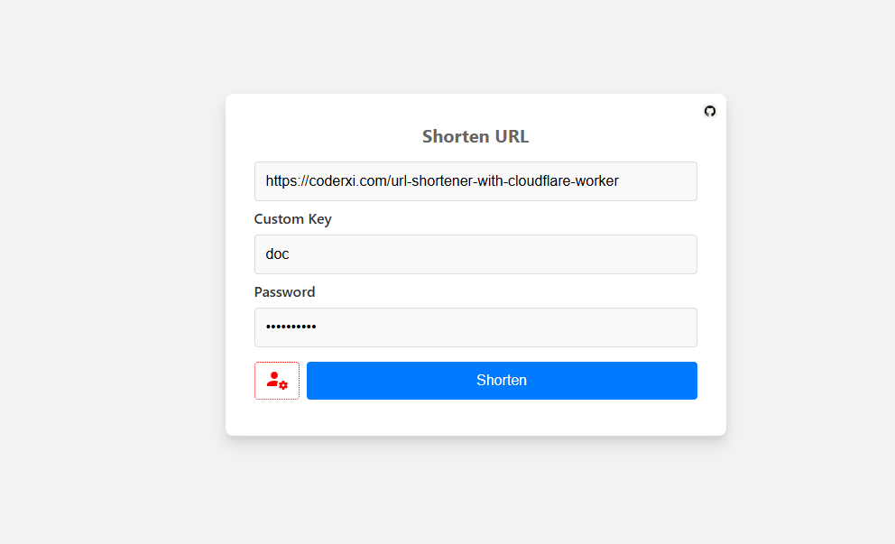
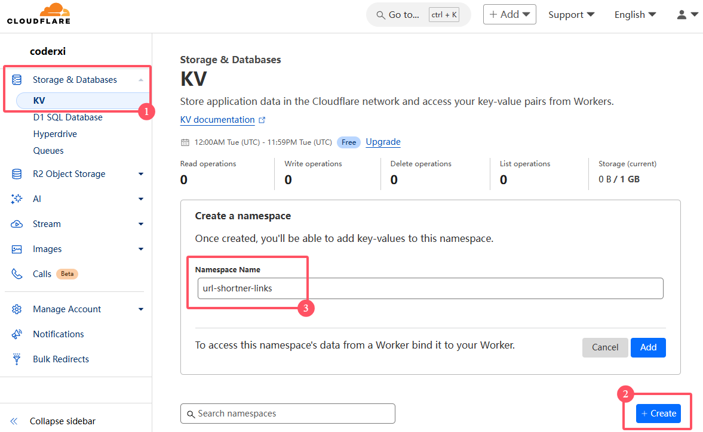
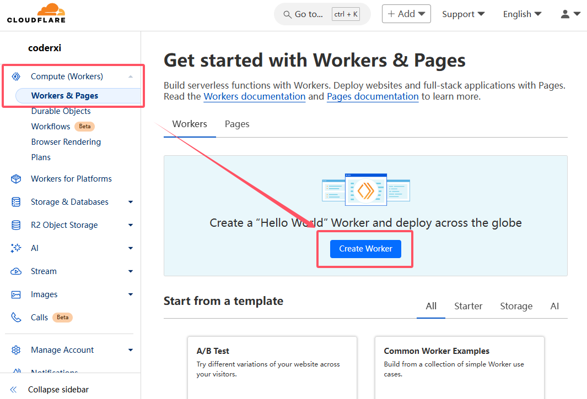
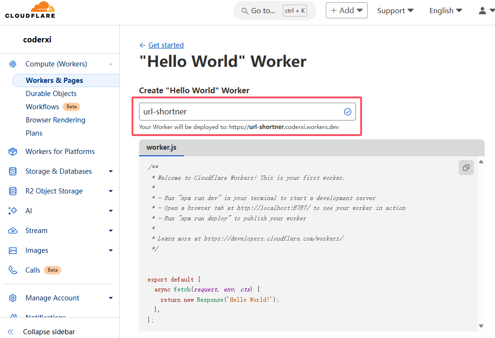
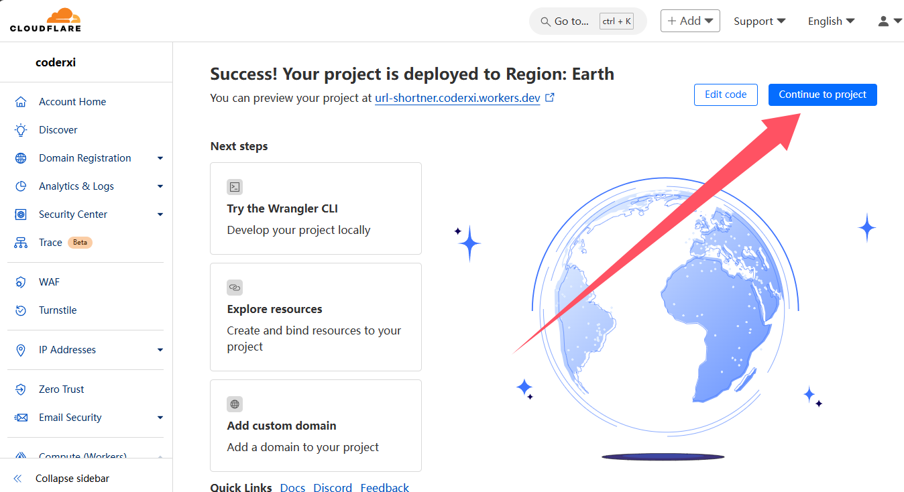
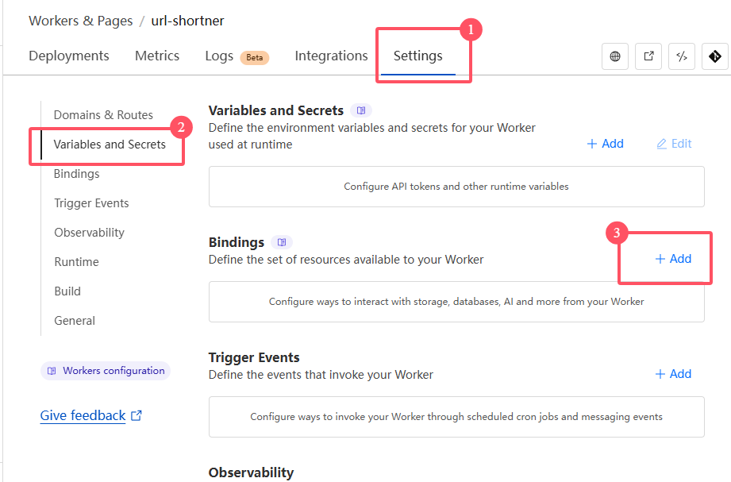
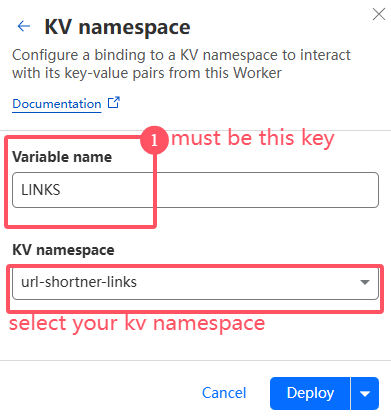
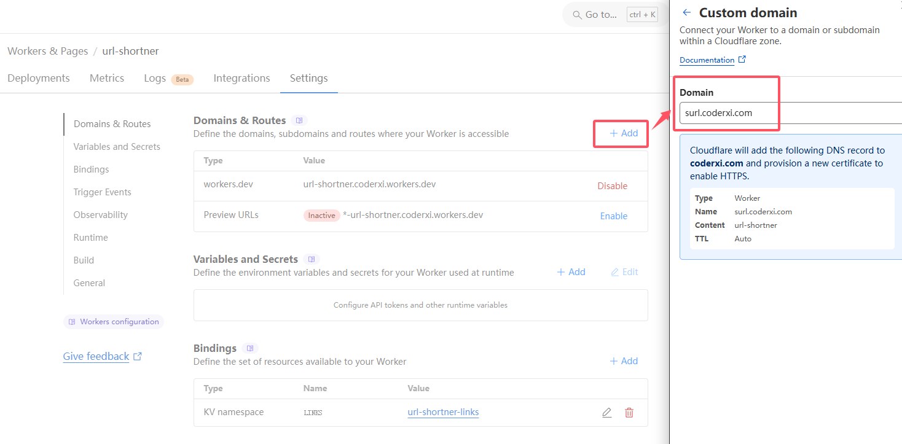
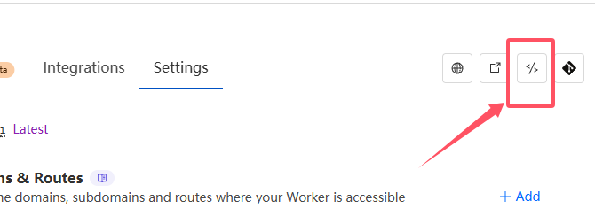

# url-shortner-worker

A simple and free url-shortner platform using Cloudflare Worker

[**DEMO**](https://surl.coderxi.com)

# Getting start

## Create KV namespace

## Create Worker

## Go to settings page

# Bind Worker & KV namespace

# Bind your domain

# Edit Worker

## Click the edit btn

## Copy release `worker.js` and Depoly

**`worker.js` for copy**：**https://github.com/coderxi1/url-shortner-worker/releases**